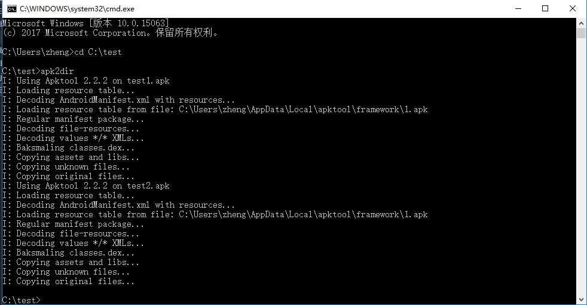

配合[apktool](https://ibotpeaches.github.io/Apktool/)
# Apk2dir
配合akptool,将当前目录下的apk文件反编译。
## 如何使用
1. 确保 [apk2dir.bat](apk2dir.bat) 在环境变量中
2. 打开 CMD
3. 切换到 apk文件 所在的目录
4. 输入 apk2dir

## Tips
1. 如果 [apk2dir.bat](apk2dir.bat) 与 [apktool.jar](apktool.jar) 不在同一目录下，将 "%~dp0\apktool.jar" 替换为 [apktool.jar](apktool.jar) 所在目录的绝对路径。

